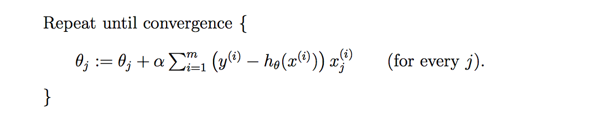
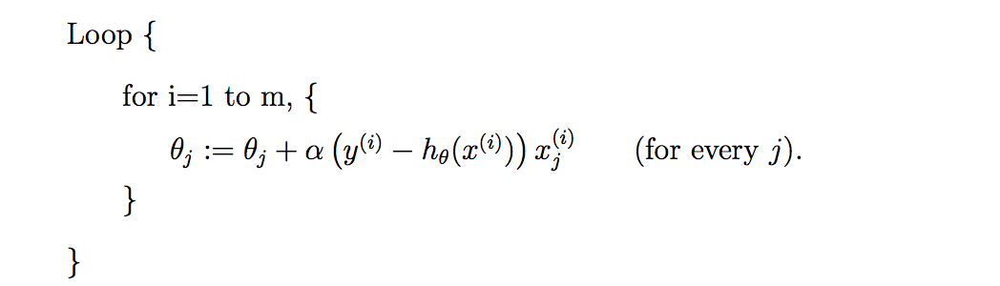

# Modeling Interview Question

## [Gradient Descent Question](http://cs229.stanford.edu/notes/cs229-notes1.pdf):

The difference between *Batch Gradient Descent* and *Stochastic Gradient Descent*?

## Answer:

For the simplicity, let's take LMS (least mean squares) update rule as an example.

This method looks at every example in the entire training set on every step, and is called **batch
gradient descent**.

We repeatedly run through the training set, and each time we encounter a training example,
we update the parameters according to the gradient of the error with respect to that single training example only.
This algorithm is called **stochastic gradient descent**.

Major differences in two methods:

1. Stochastic gradient descent gets θ “close” to the minimum much faster than batch gradient descent.
    - Whereas batch gradient descent has to scan through the entire training set before taking a single step—a costly operation if m is
      large—stochastic gradient descent can start making progress right away, and continues to make progress with each example it looks at.

2. However that it may never “converge” to the minimum and the parameters θ will keep oscillating around the minimum of J(θ); but
in practice most of the values near the minimum will be reasonably good approximations to the true minimum.

3. When the training set is large, stochastic gradient descent is often preferred over batch gradient descent.