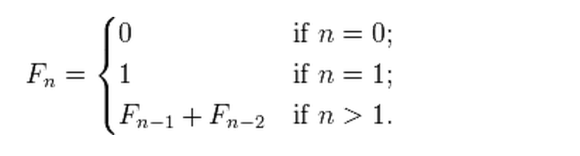

Algorithm Question In Python
============================

## Question About Recursive Algorithm 2

**Writing a function to recursively calculate a Fibonacci sequence at position n.**

HINT:


## Answer:

```python
from math import sqrt


def Fibonacci(n):
    assert type(n) == int   # the input must be an integer
    if n == 0:
        return 0
    elif n == 1:
        return 1
    else:
        return Fibonacci(n-2) + Fibonacci(n-1)


def Fib(n):
    """
    Efficient Fibonacci estimation: non-recursive approach.
    This is used to check the accuracy of Fibonacci() function.
    In terms of performance, this is the most preferred way to calculate the Fibonacci sequence.
    """
    return int( ((1 + sqrt(5)) ** n - (1 - sqrt(5)) ** n) / (2 ** n * sqrt(5)) )


def main():
    """
    Check the accuracy of the custom function.
    """
    A = Fibonacci(18)
    B = Fib(18)
    print A == B


if __name__ == "__main__":
    main()
```

screen output:
```
True
```